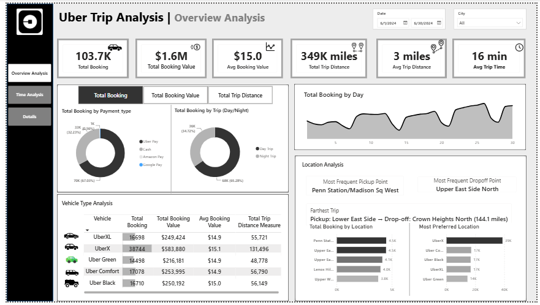

# 🚖 Uber Trip Analysis Dashboard

## 📖 Project Overview

The Uber Trip Analysis Dashboard is an interactive Power BI project designed to analyze Uber trip data and provide valuable business insights. The dashboard helps understand customer travel patterns, payment preferences, vehicle performance, trip trends, and location-based demand through interactive visualizations.

---

## 🎯 Problem Statement

Uber generates thousands of trip records every day. Analyzing this large amount of data manually is difficult and time-consuming.

The objective of this project is to analyze Uber trip data and answer important business questions such as:

- How many trips were completed?
- What is the total booking value generated?
- Which payment method is most preferred?
- What is the average trip distance and duration?
- Which vehicle type is most frequently used?
- Which pickup and drop-off locations have the highest demand?
- How does booking demand change over time?

---

## 📂 Dataset

- Uber Trip Dataset
- Records: Approximately 100K+ bookings
- Analysis Period: June 2024

---

## 🛠️ Tools & Technologies

- Power BI
- Power Query
- DAX
- Data Modeling

---

## 📊 Dashboard Features

- Total Bookings KPI
- Total Booking Value KPI
- Average Booking Value
- Total Trip Distance
- Average Trip Distance
- Average Trip Time
- Payment Type Analysis
- Day vs Night Trip Analysis
- Daily Booking Trend
- Vehicle Type Analysis
- Pickup & Drop-off Location Analysis
- Most Preferred Vehicle
- Longest Trip Analysis

---

## 📈 Key Insights

- A total of **103.7K bookings** were completed during the analysis period.
- Uber generated approximately **$1.6 Million** in booking value.
- The average booking value was **$15** per trip.
- Customers traveled a total of **349K miles**.
- The average trip distance was **3 miles**, indicating that most trips were short-distance.
- The average trip duration was **16 minutes**.
- Uber Pay was the most preferred payment method, followed by Cash.
- Night trips accounted for a larger share of bookings than day trips.
- UberX was the most preferred vehicle category.
- Penn Station/Madison Sq West was the most frequent pickup location.
- Upper East Side North was the most frequent drop-off location.
- Booking demand fluctuated throughout the month, with noticeable peaks toward the end of June.

---

## 💡 Business Recommendations

- Increase driver availability during high-demand periods.
- Position more drivers near the most popular pickup locations.
- Encourage digital payments through offers and cashback.
- Use demand trends to improve driver allocation and reduce passenger waiting time.
- Monitor vehicle demand to maintain an optimal fleet mix.
- Use trip pattern analysis for better operational planning.

---

## 📸 Dashboard Preview

---

## 📌 Conclusion

This dashboard transforms raw Uber trip data into meaningful business insights through interactive visualizations and KPIs. It enables stakeholders to monitor operational performance, understand customer behavior, and make informed, data-driven decisions.
